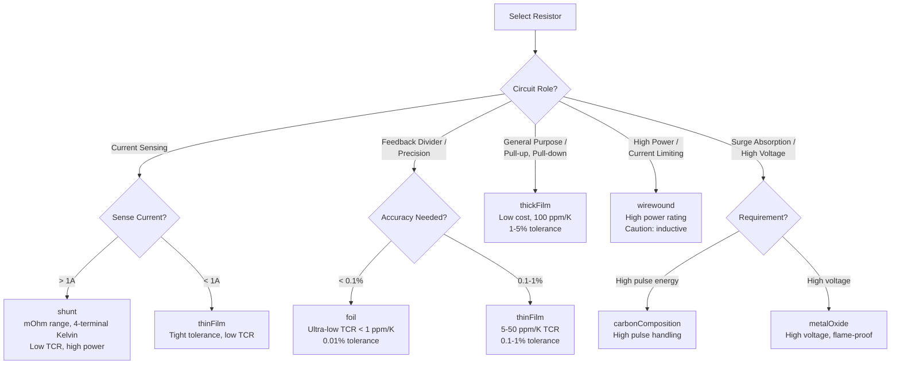
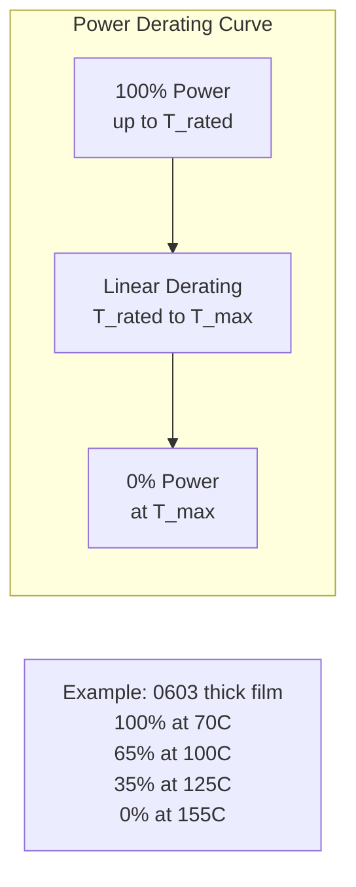

<h1 align="center">RAS - Resistor Agnostic Structure</h1>

<p align="center">
  <em>The universal data format for resistor components</em>
</p>

<p align="center">
  <a href="https://opensource.org/licenses/MIT"></a>
  <a href="https://json-schema.org/"></a>
</p>

---

## What is RAS?

**RAS is a standardized way to describe resistor components** (and varistors) used in power electronics and general electronics design. It captures everything about a resistor -- identification, electrical characteristics, thermal behavior, mechanical dimensions, simulation parameters, and derating curves -- in a single machine-readable JSON document. A RAS document holds exactly one of a `resistor` or a `varistor` (the field name selects the device type).

RAS is part of the [OpenConverters](https://github.com/OpenConverters) ecosystem and follows the same structural pattern established by [MAS (Magnetic Agnostic Structure)](https://github.com/OpenMagnetics/MAS). A valid RAS document, when wrapped with `inputs` and `outputs`, is also a valid [PEAS (Power Electronics Agnostic Structure)](../PEAS/) document.

### The Problem RAS Solves

Resistor data lives in PDF datasheets, distributor websites, and proprietary EDA libraries -- none of which talk to each other. RAS provides a single, open format that:

- Captures all datasheet parameters in one structured file
- Enables automated component selection and design-rule checking
- Includes SPICE model parameters for simulation
- Provides power derating curves for thermal analysis
- Is machine-readable for use in design automation tools

### Where Data Lives

| Location | Contents |
|----------|----------|
| `RAS/data/` | Manufacturing building blocks -- resistor series definitions, parametric families, and templates used to generate finished components |
| `TAS/data/` | Finished resistors as part of complete converter designs -- actual component instances selected for a specific power converter |

This separation follows the same principle as MAS: raw component data (cores, materials) lives in the component schema's data directory, while finished designs that use those components live in TAS.

---

## Supported Technologies

RAS covers all major resistor technologies used in power electronics:

| Technology | Typical Use | Key Properties |
|------------|-------------|----------------|
| **thinFilm** | Precision circuits, feedback dividers | Low TCR (5-50 ppm/K), tight tolerance (0.1-1%) |
| **thickFilm** | General purpose, pull-up/pull-down | Low cost, moderate TCR (100 ppm/K), 1-5% tolerance |
| **wirewound** | High power, current limiting | High power rating, low resistance values, inductive |
| **carbonComposition** | Surge absorption, legacy designs | High pulse handling, high noise |
| **metalOxide** | High voltage, flame-proof | High voltage rating, good surge capability |
| **foil** | Ultra-precision measurement | Extremely low TCR (<1 ppm/K), 0.01% tolerance |
| **shunt** | Current sensing, power metering | Very low resistance (mOhm range), 4-terminal Kelvin |

### Technology Selection Flowchart



### Power Derating Concept



---

## Document Structure

Every RAS document has three sections:

```
+----------------+     +----------------+     +----------------+
|     INPUTS     |     |    RESISTOR    |     |    OUTPUTS     |
+----------------+     +----------------+     +----------------+
| What you NEED  |  +  | What you HAVE  |  =  | What you GET   |
|                |     |                |     |                |
| * Voltage      |     | * Part number  |     | * Power diss.  |
| * Current      |     | * Resistance   |     | * Temp. rise   |
| * Temperature  |     | * Tolerance    |     | * Lifetime     |
| * Constraints  |     | * TCR          |     | * Derating     |
|                |     | * Dimensions   |     |                |
+----------------+     +----------------+     +----------------+
```

### Schema Hierarchy

RAS.json carries `inputs`, `outputs`, and **exactly one** of `{resistor,
varistor}` (a top-level `oneOf` — the field name is the device discriminator).

```
RAS.json                          # Top-level: inputs + (resistor | varistor) + outputs
  +-- inputs.json                 # Operating points (+ inputs/designRequirements.json)
  +-- resistor.json               # Resistor component data
  |     +-- manufacturerInfo
  |           +-- datasheetInfo
  |                 +-- part          # Identification
  |                 +-- electrical    # Electrical specs
  |                 +-- thermal       # Temperature range
  |                 +-- mechanical    # Dimensions, shape
  |                 +-- business      # Pricing, packaging
  |                 +-- modelParams   # SPICE parameters
  |                 +-- factors       # Derating curves
  +-- varistor.json               # Varistor (MOV) component data — same outer shape
  +-- outputs.json                # Computed results (power dissipation, temp rise, …)
  +-- utils.json                  # Shared types
        +-- dimensionWithTolerance
        +-- curve
        +-- numberArray
```

---

## Examples

### Example 1: Standard Thick Film Resistor (CRCW0603)

A Vishay CRCW0603 10k Ohm, 1%, 0.1W thick film chip resistor:

```json
{
    "resistor": {
        "manufacturerInfo": {
            "datasheetInfo": {
                "part": {
                    "partNumber": "CRCW060310K0FKEA",
                    "series": "CRCW",
                    "technology": "thickFilm",
                    "case": "0603",
                    "matchcodeDescription": "10kOhm 1% 0.1W 0603 Thick Film"
                },
                "electrical": {
                    "resistance": {"nominal": 10000},
                    "tolerance": 0.01,
                    "temperatureCoefficient": 100,
                    "powerRating": 0.1,
                    "powerRatingTemperature": 70,
                    "maxVoltage": 75,
                    "maxOverloadVoltage": 150
                },
                "thermal": {
                    "operatingTemperature": {"minimum": -55, "maximum": 155}
                },
                "mechanical": {
                    "dimensions": {
                        "length": {"nominal": 0.0016},
                        "width": {"nominal": 0.0008},
                        "height": {"nominal": 0.00045}
                    },
                    "shape": {
                        "assembly": "SMT",
                        "shapeType": "SMD Chip"
                    }
                },
                "modelParams": {
                    "r": 10000,
                    "tcr1": 100e-6,
                    "tcr2": null
                },
                "factors": {
                    "powerDeratingTemperature": [70, 100, 125, 155],
                    "powerDeratingAmplitude": [1.0, 0.65, 0.35, 0.0]
                }
            }
        }
    }
}
```

Key points:
- **resistance** uses `dimensionWithTolerance` -- here only `nominal` is given (10 kOhm)
- **tolerance** is a fraction: 0.01 means 1%
- **temperatureCoefficient** is in ppm/K: 100 ppm/K
- **dimensions** are in meters (SI units throughout)
- **powerDeratingTemperature/Amplitude** define the derating curve: full power up to 70 C, linearly derated to zero at 155 C
- **modelParams.tcr1** converts the TCR to 1/K for SPICE: 100 ppm/K = 100e-6 /K

### Example 2: Current Sense Shunt Resistor (WSK2512)

A Vishay WSK2512 10 mOhm, 1%, 1W shunt resistor for current sensing:

```json
{
    "resistor": {
        "manufacturerInfo": {
            "datasheetInfo": {
                "part": {
                    "partNumber": "WSK2512R0100FEA",
                    "series": "WSK2512",
                    "technology": "shunt",
                    "case": "2512",
                    "matchcodeDescription": "10mOhm 1% 1W 2512 Current Sense Shunt"
                },
                "electrical": {
                    "resistance": {"nominal": 0.01},
                    "tolerance": 0.01,
                    "temperatureCoefficient": 75,
                    "powerRating": 1.0,
                    "powerRatingTemperature": 70,
                    "maxVoltage": 50
                },
                "thermal": {
                    "operatingTemperature": {"minimum": -55, "maximum": 170}
                },
                "mechanical": {
                    "dimensions": {
                        "length": {"nominal": 0.0064},
                        "width": {"nominal": 0.0032},
                        "height": {"nominal": 0.0006}
                    },
                    "shape": {
                        "assembly": "SMT",
                        "shapeType": "SMD Chip"
                    }
                },
                "modelParams": {
                    "r": 0.01,
                    "tcr1": 75e-6,
                    "tcr2": null
                },
                "factors": {
                    "powerDeratingTemperature": [70, 100, 130, 155, 170],
                    "powerDeratingAmplitude": [1.0, 0.7, 0.4, 0.15, 0.0]
                }
            }
        }
    }
}
```

Key points:
- **technology** is `"shunt"` -- metal alloy element designed for current sensing
- Very low resistance (10 mOhm) with tight TCR (75 ppm/K) for accurate current measurement
- Higher power rating (1W) in a larger 2512 package
- Extended temperature range up to 170 C
- Five-point derating curve for more precise thermal management

---

## Relationship to Other Schemas

```
PEAS (Power Electronics Agnostic Structure) -- abstract base
 +-- MAS (Magnetic)    -- inductors, transformers, chokes
 +-- SAS (Semiconductor) -- MOSFETs, diodes, IGBTs
 +-- CAS (Capacitor)   -- ceramic, electrolytic, film caps
 +-- RAS (Resistor)    -- this schema
 |
 +-> TAS (Topology Agnostic Structure) -- complete converter designs
       references PEAS components (inline or by path)
```

A RAS document with `inputs` and `outputs` is a valid PEAS document. TAS references PEAS documents to describe complete power converter designs, where resistors serve roles such as `currentSenseResistor`, `gateResistor`, `feedbackResistor`, `bleederResistor`, `snubberResistor`, or `clampResistor`.

---

## Units Convention

All values use SI base units:

| Quantity | Unit | Example |
|----------|------|---------|
| Resistance | Ohms | `10000` = 10 kOhm |
| Tolerance | Fraction | `0.01` = 1% |
| TCR | ppm/K | `100` = 100 ppm/K |
| Power | Watts | `0.1` = 100 mW |
| Voltage | Volts | `75` = 75 V |
| Temperature | Celsius | `70` = 70 C |
| Dimensions | Meters | `0.0016` = 1.6 mm |
| tcr1 (SPICE) | 1/K | `100e-6` = 100 ppm/K |
| tcr2 (SPICE) | 1/K^2 | Second-order TCR |

---

## File Organization

```
RAS/
+-- schemas/
|     +-- RAS.json          # Top-level: inputs + (resistor | varistor) + outputs
|     +-- inputs.json       # Operating points
|     +-- inputs/
|     |     +-- designRequirements.json
|     +-- resistor.json     # Resistor component schema
|     +-- varistor.json     # Varistor (MOV) component schema
|     +-- outputs.json      # Computed results schema
|     +-- utils.json        # Shared types (dimensionWithTolerance, curve, numberArray)
+-- data/
|     +-- resistors.ndjson  # Manufacturing building blocks (series definitions)
+-- examples/
      +-- 01_resistor_crcw0603.json        # Thick film chip resistor
      +-- 02_shunt_resistor_wsk2512.json   # Current sense shunt resistor
```

---

## License

This project is licensed under the MIT License.

---

<p align="center">
  Part of the <a href="https://github.com/OpenConverters">OpenConverters</a> ecosystem
</p>
