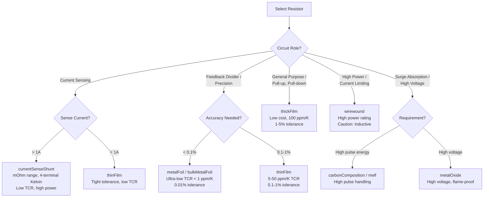
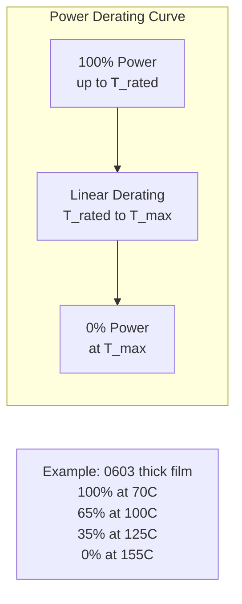

<h1 align="center">RAS - Resistor Agnostic Structure</h1>

<p align="center">
  <em>The universal data format for resistor components</em>
</p>

<p align="center">
  <a href="https://opensource.org/licenses/MIT"></a>
  <a href="https://json-schema.org/"></a>
</p>

---

## What is RAS?

**RAS is a standardized way to describe resistor components** (and varistors and thermistors) used in power electronics and general electronics design. It captures everything about a resistor -- identification, electrical characteristics, thermal behavior, mechanical dimensions, simulation parameters, and derating curves -- in a single machine-readable JSON document. A RAS document holds exactly one of a `resistor`, a `varistor` or a `thermistor` (the field name selects the device type).

RAS is part of the [OpenConverters](https://github.com/OpenConverters) ecosystem and follows the same structural pattern established by [MAS (Magnetic Agnostic Structure)](https://github.com/OpenMagnetics/MAS). A valid RAS document, when wrapped with `inputs` and `outputs`, is also a valid [PEAS (Power Electronics Agnostic Structure)](../PEAS/) document.

### The Problem RAS Solves

Resistor data lives in PDF datasheets, distributor websites, and proprietary EDA libraries -- none of which talk to each other. RAS provides a single, open format that:

- Captures all datasheet parameters in one structured file
- Enables automated component selection and design-rule checking
- Includes SPICE model parameters for simulation
- Provides power derating curves for thermal analysis
- Is machine-readable for use in design automation tools

### Where Data Lives

| Location | Contents |
|----------|----------|
| `RAS/data/` | Manufacturing building blocks -- resistor series definitions, parametric families, and templates used to generate finished components |
| `TAS/data/` | Finished resistors as part of complete converter designs -- actual component instances selected for a specific power converter |

This separation follows the same principle as MAS: raw component data (cores, materials) lives in the component schema's data directory, while finished designs that use those components live in TAS.

---

## Supported Technologies

The resistor `technology` field is a closed 11-value enum (`schemas/resistor.json`); the requirements-side `allowedTechnologies` uses the same values.

| Technology | Typical Use | Key Properties |
|------------|-------------|----------------|
| **thinFilm** | Precision circuits, feedback dividers | Low TCR (5-50 ppm/K), tight tolerance (0.1-1%) |
| **thickFilm** | General purpose, pull-up/pull-down | Low cost, moderate TCR (100 ppm/K), 1-5% tolerance |
| **metalFilm** | Precision leaded resistors | Low noise, good stability, 50-100 ppm/K |
| **metalOxide** | High voltage, flame-proof | High voltage rating, good surge capability |
| **wirewound** | High power, current limiting | High power rating, low resistance values, inductive |
| **carbonComposition** | Surge absorption, legacy designs | High pulse handling, high noise |
| **carbonFilm** | Low-cost general purpose (leaded) | Cheap, moderate performance |
| **metalFoil** | Ultra-precision measurement | Extremely low TCR (<1 ppm/K), 0.01% tolerance |
| **bulkMetalFoil** | Ultimate precision (Vishay bulk foil) | Best-in-class TCR and long-term stability |
| **currentSenseShunt** | Current sensing, power metering | Very low resistance (mOhm range), 4-terminal Kelvin |
| **melf** | Precision/pulse SMD (cylindrical) | Metal-film performance in SMD form, good pulse handling |

Varistors have their own 4-value technology enum (`schemas/varistor.json`): `metalOxide` (disc MOVs), `siliconCarbide`, `multiLayer` (chip MLVs), `polymer`.

Thermistors have a 2-value technology enum (`schemas/thermistor.json#/$defs/technology`): `ntc` (temperature sensing/compensation, inrush current limiting), `ptc` (ceramic switching PTC — overtemperature sensing, self-regulating heating). **Scope note**: resettable polymer PTC fuses (PPTC / "polyfuse") are protection parts, NOT thermistors, and are out of RAS scope.

### Technology Selection Flowchart



### Power Derating Concept



---

## Document Structure

Every RAS document has three sections:

```
+----------------+     +----------------+     +----------------+
|     INPUTS     |     |    RESISTOR    |     |   OUTPUTS[]    |
+----------------+     +----------------+     +----------------+
| What you NEED  |  +  | What you HAVE  |  =  | What you GET   |
|                |     |                |     | (per op point) |
| * Operating    |     | * Part number  |     | * Power diss.  |
|   points (V/I) |     | * Resistance   |     | * Temp. rise   |
| * Design       |     | * Tolerance    |     | * Pulse stress |
|   requirements |     | * TCR          |     | * Lifetime     |
|   (R, power,   |     | * Dimensions   |     | * Drift, noise |
|    role, ...)  |     | * Derating     |     |                |
+----------------+     +----------------+     +----------------+
```

`inputs` is fully structured: `operatingPoints[]` (PEAS `twoTerminalOperatingPoint`) plus `designRequirements` with a `deviceType` discriminator (`resistor` requires `resistance`; `varistor` requires `ratedContinuousVoltage` plus at least one of `minimumEnergyAbsorption` / `minimumPeakSurgeCurrent`; `thermistor` requires `resistanceAt25C`). `outputs` is an **array** of per-operating-point result bundles (7 sealed blocks: `powerDissipation`, `temperature`, `effectiveResistance`, `pulseStress`, `lifetime`, `noise`, `drift`), each carrying `{origin, methodUsed}` provenance.

### Schema Hierarchy

RAS.json carries `inputs`, `outputs`, and **exactly one** of `{resistor,
varistor, thermistor}` (a top-level `oneOf` — the field name is the device discriminator).
All component objects also allow an **empty seed** (`{}`) for pre-sourcing slots.

```
RAS.json                          # Top-level: inputs + (resistor | varistor | thermistor) + outputs[]
  +-- inputs.json                 # Operating points + design requirements
  |     +-- inputs/designRequirements.json   # deviceType-discriminated (resistor | varistor | thermistor)
  +-- resistor.json               # Resistor component data
  |     +-- manufacturerInfo (name + datasheetInfo required)
  |     |     +-- datasheetInfo
  |     |           +-- part          # Identification + technology enum
  |     |           +-- electrical    # Electrical specs
  |     |           +-- thermal       # Temperature range, Rth      (shared, utils.json)
  |     |           +-- mechanical    # Flat: L/W/H/diameter, case  (shared, utils.json)
  |     |           +-- modelParams   # SPICE parameters
  |     |           +-- factors       # powerDerating curve
  |     +-- distributorsInfo          # Commercial data (PEAS distributorInfo)
  +-- varistor.json               # Varistor (MOV) component data — same outer shape
  |                               #   (+ viCurve; electrical requires varistorVoltage,
  |                               #    clampingVoltage, peakSurgeCurrent)
  +-- thermistor.json             # Thermistor (NTC / PTC) component data — same outer shape
  |                               #   (electrical requires resistanceAt25C; B constant,
  |                               #    inrush ratings, dissipation/time constants optional)
  +-- outputs.json                # Computed results (7 sealed per-operating-point blocks)
  +-- utils.json                  # RAS shared types
        +-- thermal
        +-- mechanical
        +-- deratingCurve
```

Generic primitives (`dimensionWithTolerance`, `curve`, `numberArray`, `distributorInfo`, `provenance`) come from `PEAS/schemas/utils.json`, referenced by absolute `$id`. There is no `business` section: packaging, MOQ, and pricing live in `distributorsInfo`.

---

## Examples

All four examples live in `examples/` and validate against `schemas/RAS.json`. The snippets below are trimmed for readability but schema-true.

### Example 1: Standard Thick Film Resistor (`examples/01_resistor_crcw0603.json`)

A Vishay CRCW0603 10k Ohm, 1%, 0.1W thick film chip resistor:

```json
{
    "inputs": {
        "operatingPoints": [
            {
                "name": "nominal",
                "conditions": {"ambientTemperature": 25},
                "excitation": {
                    "frequency": 1000,
                    "voltage": {"processed": {"label": "sinusoidal", "peak": 5, "offset": 0}},
                    "current": {"processed": {"label": "sinusoidal", "peak": 0.0005, "offset": 0}}
                }
            }
        ],
        "designRequirements": {
            "name": "10k feedback divider",
            "deviceType": "resistor",
            "resistance": {"nominal": 10000},
            "powerRating": 0.1,
            "maximumTcr": 200,
            "allowedTechnologies": ["thinFilm", "thickFilm"]
        }
    },
    "resistor": {
        "manufacturerInfo": {
            "name": "Vishay",
            "reference": "CRCW060310K0FKEA",
            "datasheetInfo": {
                "part": {
                    "partNumber": "CRCW060310K0FKEA",
                    "series": "CRCW",
                    "technology": "thickFilm",
                    "case": "0603",
                    "matchcodeDescription": "10kOhm 1% 0.1W 0603 Thick Film"
                },
                "electrical": {
                    "resistance": {"nominal": 10000},
                    "tolerance": 0.01,
                    "temperatureCoefficient": 100,
                    "powerRating": 0.1,
                    "powerRatingTemperature": 70,
                    "maxVoltage": 75,
                    "maxOverloadVoltage": 150
                },
                "thermal": {
                    "operatingTemperature": {"minimum": -55, "maximum": 155}
                },
                "mechanical": {
                    "assemblyType": "smt",
                    "case": "0603",
                    "shapeType": "SMD chip",
                    "length": {"nominal": 0.0016},
                    "width": {"nominal": 0.0008},
                    "height": {"nominal": 0.00045}
                },
                "modelParams": {
                    "r": 10000,
                    "tcr1": 0.0001
                },
                "factors": {
                    "powerDerating": {
                        "temperature": [70, 100, 125, 155],
                        "amplitude": [1.0, 0.65, 0.35, 0.0]
                    }
                }
            }
        }
    },
    "outputs": [{}]
}
```

Key points:
- **resistance** uses `dimensionWithTolerance` -- here only `nominal` is given (10 kOhm)
- **tolerance** is a fraction: 0.01 means 1%
- **temperatureCoefficient** is in ppm/K: 100 ppm/K
- **mechanical** is a flat object: dimensions, `shapeType`, `case`, and `assemblyType` (lowercase PEAS `connectionType`: `smt`, `tht`, ...) sit side by side
- **dimensions** are in meters (SI units throughout)
- **factors.powerDerating** holds the derating curve as paired `temperature`/`amplitude` arrays: full power up to 70 C, linearly derated to zero at 155 C
- **modelParams.tcr1** converts the TCR to 1/K for SPICE: 100 ppm/K = 0.0001 /K (omit `tcr2` when unknown -- it is not nullable)

### Example 2: Current Sense Shunt Resistor (`examples/02_shunt_resistor_wsk2512.json`)

A Vishay WSK2512 10 mOhm, 1%, 1W shunt resistor for current sensing:

```json
{
    "inputs": {
        "operatingPoints": [
            {
                "name": "nominal",
                "conditions": {"ambientTemperature": 25},
                "excitation": {
                    "frequency": 100000,
                    "voltage": {"processed": {"label": "rectangular", "peak": 0.2, "offset": 0.1}},
                    "current": {"processed": {"label": "rectangular", "peak": 20, "offset": 10}}
                }
            }
        ],
        "designRequirements": {
            "name": "current sense shunt",
            "deviceType": "resistor",
            "resistance": {"nominal": 0.01},
            "powerRating": 1.0,
            "allowedTechnologies": ["currentSenseShunt", "metalFoil", "wirewound"]
        }
    },
    "resistor": {
        "manufacturerInfo": {
            "name": "Vishay",
            "reference": "WSK2512R0100FEA",
            "datasheetInfo": {
                "part": {
                    "partNumber": "WSK2512R0100FEA",
                    "series": "WSK2512",
                    "technology": "currentSenseShunt",
                    "case": "2512",
                    "matchcodeDescription": "10mOhm 1% 1W 2512 Current Sense Shunt"
                },
                "electrical": {
                    "resistance": {"nominal": 0.01},
                    "tolerance": 0.01,
                    "temperatureCoefficient": 75,
                    "powerRating": 1.0,
                    "powerRatingTemperature": 70,
                    "maxVoltage": 50
                },
                "thermal": {
                    "operatingTemperature": {"minimum": -55, "maximum": 170}
                },
                "mechanical": {
                    "assemblyType": "smt",
                    "case": "2512",
                    "shapeType": "SMD chip",
                    "length": {"nominal": 0.0064},
                    "width": {"nominal": 0.0032},
                    "height": {"nominal": 0.0006}
                },
                "modelParams": {
                    "r": 0.01,
                    "tcr1": 7.5e-05
                },
                "factors": {
                    "powerDerating": {
                        "temperature": [70, 100, 130, 155, 170],
                        "amplitude": [1.0, 0.7, 0.4, 0.15, 0.0]
                    }
                }
            }
        }
    },
    "outputs": [{}]
}
```

Key points:
- **technology** is `"currentSenseShunt"` -- metal alloy element designed for current sensing
- Very low resistance (10 mOhm) with tight TCR (75 ppm/K) for accurate current measurement
- Higher power rating (1W) in a larger 2512 package
- Extended temperature range up to 170 C
- Five-point derating curve for more precise thermal management

### Example 3: Disc MOV Varistor (`examples/03_varistor_b72214.json`)

An EPCOS / TDK B72214 (S14K275) 275 Vrms metal-oxide disc varistor for 230 Vac mains surge clamping. Note the `varistor` top-level field and the `deviceType: "varistor"` requirements branch:

```json
{
    "inputs": {
        "operatingPoints": [
            {
                "name": "ac mains surge protection",
                "conditions": {"ambientTemperature": 25},
                "excitation": {
                    "frequency": 50,
                    "voltage": {"processed": {"label": "sinusoidal", "peak": 325, "offset": 0}},
                    "current": {"processed": {"label": "sinusoidal", "peak": 0.0005, "offset": 0}}
                }
            }
        ],
        "designRequirements": {
            "name": "230 Vac mains surge clamp",
            "deviceType": "varistor",
            "ratedContinuousVoltage": 275,
            "voltageType": "ac",
            "maximumClampingVoltage": 710,
            "minimumPeakSurgeCurrent": 6000,
            "minimumEnergyAbsorption": 80,
            "role": "surgeProtection",
            "allowedTechnologies": ["metalOxide"]
        }
    },
    "varistor": {
        "manufacturerInfo": {
            "name": "EPCOS / TDK",
            "reference": "B72214S2271K101",
            "status": "production",
            "datasheetInfo": {
                "part": {
                    "partNumber": "B72214S2271K101",
                    "series": "S14K",
                    "technology": "metalOxide",
                    "case": "S14"
                },
                "electrical": {
                    "varistorVoltage": {"minimum": 387, "nominal": 430, "maximum": 473},
                    "maxContinuousAcVoltage": 275,
                    "maxContinuousDcVoltage": 350,
                    "clampingVoltage": 710,
                    "clampingCurrent": 100,
                    "peakSurgeCurrent": 6000,
                    "surgeWaveform": "8/20",
                    "energyAbsorption": 110,
                    "capacitance": 3.2e-10,
                    "leakageCurrent": 5e-05,
                    "nonlinearityCoefficient": 35
                },
                "thermal": {
                    "operatingTemperature": {"minimum": -40, "maximum": 85}
                },
                "mechanical": {
                    "assemblyType": "tht",
                    "case": "S14",
                    "shapeType": "Disc",
                    "diameter": {"nominal": 0.014},
                    "height": {"nominal": 0.0042}
                }
            }
        },
        "distributorsInfo": [
            {
                "name": "Digi-Key",
                "reference": "495-2424-ND",
                "cost": {"value": 0.22, "currency": "USD"},
                "stock": 18000,
                "packaging": "Bulk",
                "vpe": 1000,
                "moq": 1
            }
        ]
    },
    "outputs": [{}]
}
```

Key points:
- The varistor electrical trio **varistorVoltage / clampingVoltage / peakSurgeCurrent** is required
- `energyAbsorption` is optional -- multilayer chip varistors publish no Joule rating
- The varistor design-requirements branch requires `ratedContinuousVoltage` plus at least one of `minimumEnergyAbsorption` / `minimumPeakSurgeCurrent`
- Commercial data (cost, stock, MOQ) lives in `distributorsInfo`, not inside `datasheetInfo`

### Example 4: NTC Inrush Current Limiter (`examples/04_thermistor_sl22.json`)

An Ametherm SL22 10005 (10 Ohm / 5 A / 22 mm disc) NTC thermistor limiting the bulk-capacitor inrush of a 230 Vac SMPS. Note the `thermistor` top-level field and the `deviceType: "thermistor"` requirements branch:

```json
{
    "inputs": {
        "designRequirements": {
            "name": "230 Vac SMPS bulk-capacitor inrush limiter",
            "deviceType": "thermistor",
            "resistanceAt25C": {"nominal": 10},
            "minimumSteadyStateCurrent": 5,
            "minimumEnergy": 40,
            "role": "inrushLimiting",
            "allowedTechnologies": ["ntc"]
        }
    },
    "thermistor": {
        "manufacturerInfo": {
            "name": "Ametherm",
            "reference": "SL22 10005",
            "datasheetInfo": {
                "part": {"partNumber": "SL22 10005", "series": "SL", "technology": "ntc", "case": "SL22"},
                "electrical": {
                    "resistanceAt25C": {"nominal": 10},
                    "resistanceTolerance": 0.2,
                    "bConstant": 2700,
                    "bConstantTemperatures": [25, 85],
                    "maximumSteadyStateCurrent": 5,
                    "maximumEnergy": 50,
                    "dissipationConstant": 0.0248,
                    "thermalTimeConstant": 95
                }
            }
        }
    },
    "outputs": [{}]
}
```

Key points:
- Only **resistanceAt25C** is required in the thermistor electrical block -- inrush limiters lead with `maximumSteadyStateCurrent` / `maximumEnergy`, sensing NTCs with `bConstant` (+ its `bConstantTemperatures` pair, e.g. B25/85), PTCs with `switchTemperature`
- The thermistor design-requirements branch requires `resistanceAt25C`; its `allowedTechnologies` items `$ref` the part-side `thermistor.json#/$defs/technology` anchor (`ntc` / `ptc`)
- Resettable polymer PTC fuses (PPTC) are protection parts, not thermistors -- out of RAS scope

---

## Relationship to Other Schemas

```
PEAS (Power Electronics Agnostic Structure) -- abstract base
 +-- MAS (Magnetic)    -- inductors, transformers, chokes
 +-- SAS (Semiconductor) -- MOSFETs, diodes, IGBTs
 +-- CAS (Capacitor)   -- ceramic, electrolytic, film caps
 +-- RAS (Resistor)    -- this schema (resistors + varistors + thermistors)
 |
 +-> TAS (Topology Agnostic Structure) -- complete converter designs
       references PEAS components (inline or by path)
```

A RAS document with `inputs` and `outputs` is a valid PEAS document. TAS references PEAS documents to describe complete power converter designs, where resistors serve roles such as `currentSense`, `gate`, `feedback`, `bleed`, `snubber`, or `preCharge` (the `designRequirements.role` enum).

---

## Units Convention

All values use SI base units:

| Quantity | Unit | Example |
|----------|------|---------|
| Resistance | Ohms | `10000` = 10 kOhm |
| Tolerance | Fraction | `0.01` = 1% |
| TCR | ppm/K | `100` = 100 ppm/K |
| Power | Watts | `0.1` = 100 mW |
| Voltage | Volts | `75` = 75 V |
| Energy | Joules | `110` = 110 J |
| Capacitance | Farads | `3.2e-10` = 320 pF |
| Temperature | Celsius | `70` = 70 C |
| Dimensions | Meters | `0.0016` = 1.6 mm |
| tcr1 (SPICE) | 1/K | `100e-6` = 100 ppm/K |
| tcr2 (SPICE) | 1/K^2 | Second-order TCR |

---

## File Organization

```
RAS/
+-- schemas/
|     +-- RAS.json          # Top-level: inputs + (resistor | varistor | thermistor) + outputs[]
|     +-- inputs.json       # Operating points + design requirements
|     +-- inputs/
|     |     +-- designRequirements.json   # deviceType-discriminated requirements
|     +-- resistor.json     # Resistor component schema
|     +-- varistor.json     # Varistor (MOV) component schema
|     +-- thermistor.json   # Thermistor (NTC / PTC) component schema
|     +-- outputs.json      # Computed results schema (7 sealed blocks)
|     +-- utils.json        # RAS shared types (thermal, mechanical, deratingCurve)
+-- data/
|     +-- resistors.ndjson  # Manufacturing building blocks (series definitions)
+-- examples/
|     +-- 01_resistor_crcw0603.json        # Thick film chip resistor
|     +-- 02_shunt_resistor_wsk2512.json   # Current sense shunt resistor
|     +-- 03_varistor_b72214.json          # Metal-oxide disc varistor (MOV)
|     +-- 04_thermistor_sl22.json          # NTC inrush current limiter
+-- docs/
      +-- schema.md         # Detailed field-by-field schema reference
```

---

## License

This project is licensed under the MIT License -- see the [LICENSE](LICENSE) file.

---

<p align="center">
  Part of the <a href="https://github.com/OpenConverters">OpenConverters</a> ecosystem
</p>
